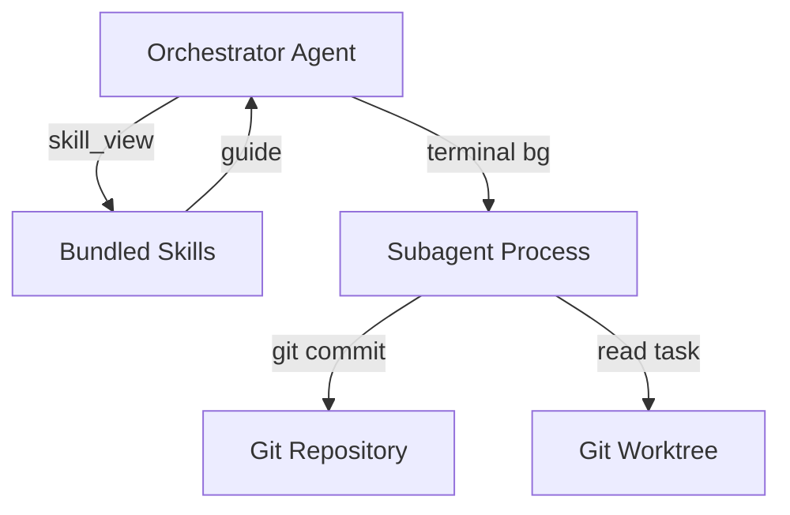
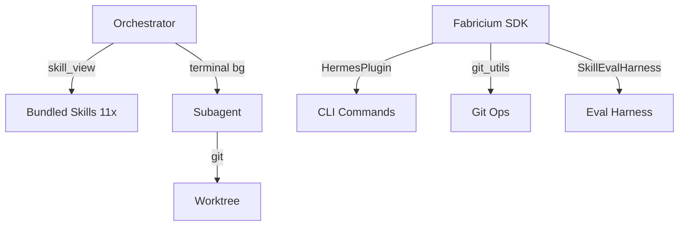

# Architecture — Jovaltus

Jovaltus is a Hermes plugin that bundles 11 agent skills for a complete
development pipeline. The plugin itself is minimal (~55 lines of Python);
all behavior is defined in skill documents.

## System Context (C4 Level 1)



**Users:** An orchestrator agent (human + LLM) that loads skills and follows
their guidance to drive the development pipeline.

**External services:**

| Service | Purpose | Protocol |
|---------|---------|----------|
| Hermes Agent Runtime | Host process; calls `register(ctx)` at startup | Python in-process |
| LLM Provider | Powers orchestrator + subagent reasoning | HTTP API |
| Git Repository | Source of truth; subagents commit to isolated worktrees | git CLI |
| Docker | Isolated environment for eval harness | Docker API |

## Container View (C4 Level 2)



| Container | Technology | Purpose |
|-----------|-----------|---------|
| Bundled Skills | Markdown (SKILL.md) | 11 self-contained skill documents — pipeline phases + utilities |
| Orchestrator | Hermes agent | Loads skills, spawns subagents, controls pipeline flow |
| Subagent Process | Hermes `terminal(background=true)` | Isolated execution in worktree; implements, reviews, tests |
| Fabricium SDK | `fabricium` pkg | `git_utils`, `HermesPlugin` (CLI + skill auto-discovery), `SkillEvalHarness` |
| CLI Commands | `hermes jovaltus setup\|status\|update` | Profile management + skill installation |

## Pipeline Flow (Skill-Driven)

```
discuss → design → to-spec → to-tasks → to-environment → execute → (review + merge → qa)
```

The orchestrator loads one skill at a time. Each skill describes:
- **What** to produce at that phase
- **How** to produce it (step-by-step)
- **When** to move to the next phase (acceptance criteria)

No hardcoded pipeline engine. The orchestrator reads the skill, follows its
guidance, produces the artifact, then loads the next skill.

### Phase Details

| Phase | Skill | Input | Output | Subagents? |
|-------|-------|-------|--------|------------|
| 1 | `discuss` | User idea | `prd.md` | No |
| 2 | `design` | PRD | `design.md` | No |
| 3 | `to-spec` | PRD + design | Implementation specs | No |
| 4 | `to-tasks` | Specs | Manifest + task files | No |
| 5 | `to-environment` | Manifest | Git worktrees | No |
| 6 | `execute` | Worktrees | Implemented code | Yes (parallel) |
| 7 | `review` | Implemented code | Reviewed + merged code | Yes (per worktree) |
| 8 | `qa` | Merged code | QA report | Yes |

### Parallel Execution Model

The `execute` phase is **flat-parallel**: all tasks run simultaneously because
file ownership is proven disjoint by `to-tasks`. Cross-task dependencies are
resolved via **inlined interface contracts** (function signatures, types) in
each TASK.md — no runtime coupling, no task-to-task communication.

```
to-tasks proves no file overlaps
    → to-environment creates isolated worktrees
        → execute spawns N subagents simultaneously
            → all commit independently, zero merge conflicts
```

## Plugin Architecture

The plugin entry point (`src/jovaltus/__init__.py`, 55 lines):

```python
def _ensure_fabricium():
    # Self-bootstrap: pip install fabricium if missing
    # Survives Hermes venv recreation during updates

plugin = HermesPlugin(
    name="jovaltus",
    plugin_dir=_PLUGIN_DIR,
    default_profile="jovaltus-agent",
)

def register(ctx):
    plugin.register(ctx)  # Fabricium handles: CLI commands + skill discovery
```

**What Fabricium handles:**
- CLI command registration (`setup`, `status`, `update`, `update --check`)
- Bundled skill auto-discovery from `src/jovaltus/skills/`
- Git operations via `fabricium.git_utils`
- Eval harness via `fabricium.evals.SkillEvalHarness`

**What the plugin does NOT do (unlike v0.5.x):**
- No tool handlers — no `jovaltus_implement`, `jovaltus_verify`, `jovaltus_simplify`
- No state machine — no `state.py`, no stage tracking
- No hooks — no `hooks.py`, no guidance injection
- No subagent spawning — the orchestrator spawns subagents directly via `terminal(background=true)`

## Key Architectural Decisions

| Decision | Rationale | Status |
|----------|-----------|--------|
| Skill-driven, not engine-driven | Pipeline flexibility; skills editable without touching Python | Active |
| Flat-parallel execution | File ownership proven disjoint → zero merge conflicts | Active |
| Fabricium as sole dependency | Avoids duplicating git wrappers, CLI registration, and skill bundling | Active |
| Self-bootstrap fabricium on import | Hermes may recreate venv, dropping plugin deps; repair on first import | Active |
| Minimal plugin (< 60 lines) | Plugin is glue; skills contain all behavior | Active |
| Worktree isolation per task | Prevents cross-task contamination; enables true parallelism | Active |
| Interface contracts in TASK.md | Eliminates cross-task runtime dependencies | Active |

## Deployment

Jovaltus is distributed as a pip-installable Hermes plugin via PyPI (trusted publisher).

```
CI/CD → git tag → PyPI trusted publisher → pip install jovaltus
```

`hermes jovaltus setup` creates the `jovaltus-agent` profile, installs bundled
skills, and optionally applies `SOUL.md`.

## How to Update

- New skill added? → Add to Phase Details table + Pipeline Flow diagram
- Pipeline order changes? → Update flow diagram + phase numbering
- Plugin API changes? → Update Plugin Architecture section
- Fabricium API changes? → Update Container View

## Find It Fast

```bash
ls src/jovaltus/skills/                      # All bundled skills
cat src/jovaltus/__init__.py                 # Plugin entry (55 lines)
grep -rn 'register' src/jovaltus/__init__.py # Registration logic
```
