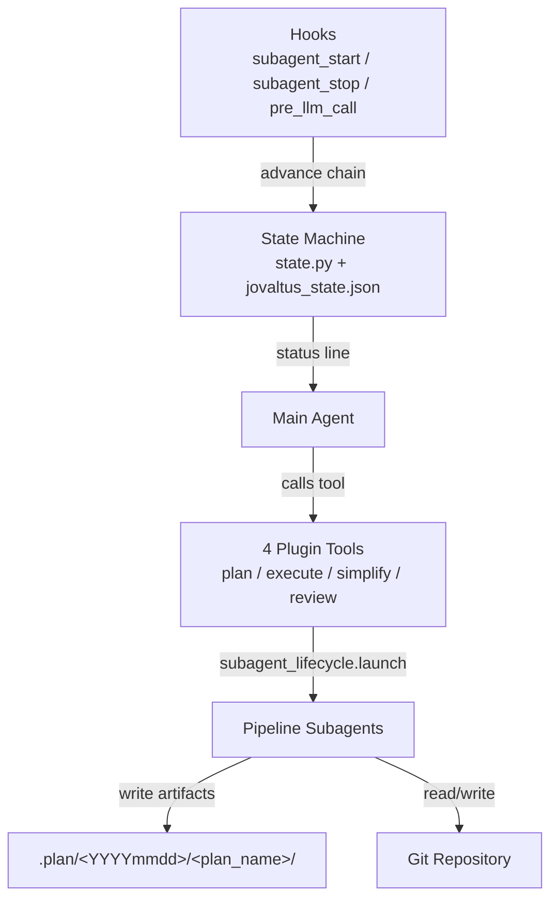
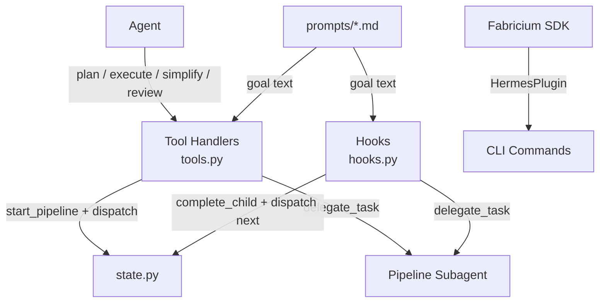

# Architecture — Jovaltus

Jovaltus is a Hermes plugin that implements a **subagent-driven deterministic
development framework**. The plugin ships 4 tools (`plan`, `execute`,
`simplify`, `review`) whose handlers dispatch isolated subagents via
Hermes's `subagent_lifecycle`; a plugin-owned state machine
(`state.py`, JSON-persisted for cross-session resume) records every phase
transition; and 3 hooks (`subagent_start`, `subagent_stop`, `pre_llm_call`)
drive the chain forward deterministically and inject pipeline status into
the main agent's context every turn. The main agent does NOT decide pipeline
flow — it calls tools and reads status.

The plugin also bundles **5 utility skills** (`agentic-debugging`,
`manage-agents-md`, `manage-git-repo`, `project-documentation`, `qa`) that
pipeline subagents load for specific jobs. The 4 tools, state machine, and
hooks are implemented in Python; the skills are independent Hermes skills.

## System Context (C4 Level 1)


```mermaid
graph TD
    Agent[Main Agent] -->|calls tool| Tools[4 Plugin Tools<br/>plan / execute / simplify / review]
    Tools -->|subagent_lifecycle.launch| Sub[Pipeline Subagents]
    Hooks[Hooks<br/>subagent_start / subagent_stop / pre_llm_call] -->|advance chain| State[State Machine<br/>state.py + jovaltus_state.json]
    State -->|status line| Agent
    Sub -->|write artifacts| RunDir[.plan/&lt;YYYYmmdd&gt;/&lt;plan_name&gt;/]
    Sub -->|read/write| Repo[Git Repository]
```

**Users:** A main agent (human + LLM) that calls the 4 tools and reads the
hook-injected status line.

**External services:**

| Service | Purpose | Protocol |
|---------|---------|----------|
| Hermes Agent Runtime | Host process; calls `register(ctx)` at startup | Python in-process |
| LLM Provider | Powers main agent + pipeline subagents | HTTP API |
| Git Repository | Source of truth; `execute` leaves the diff uncommitted for simplify/review | git CLI |
| `~/.hermes/jovaltus_state.json` | Persisted pipeline state (cross-session resume) | JSON via `fabricium.state` |

## Container View (C4 Level 2)


```mermaid
graph TD
    Agent -->|plan / execute / simplify / review| Tools[Tool Handlers<br/>tools.py]
    Tools -->|start_pipeline + dispatch| State[state.py]
    Tools -->|delegate_task| Sub[Pipeline Subagent]
    Hooks[Hooks<br/>hooks.py] -->|complete_child + dispatch next| State
    Hooks -->|delegate_task| Sub
    Prompts[prompts/*.md] -->|goal text| Tools
    Prompts -->|goal text| Hooks
    Fabricium[Fabricium SDK] -->|HermesPlugin| CLI[CLI Commands]
```

| Container | Technology | Purpose |
|-----------|-----------|---------|
| Tool Handlers (`tools.py`) | Python | Validate args, start pipeline, dispatch first-phase subagent; `execute` also checks `delegation.max_spawn_depth` |
| State Machine (`state.py`) | Python + JSON | `PipelineState` dataclass; phase/status/child/verdict bookkeeping; persisted under the `"pipeline"` key |
| Hooks (`hooks.py`) | Python | `subagent_start` associates children, `subagent_stop` advances the chain, `pre_llm_call` injects status |
| Subagent Prompts (`prompts/`) | Markdown | 9 goal documents, one per phase, with `[[token]]` placeholders |
| Bundled Skills (`skills/`) | Markdown (SKILL.md) | 5 utility skills loaded by subagents |
| CLI Commands | `hermes jovaltus setup\|status\|update` | Profile management + skill installation (fabricium) |

## Plugin Architecture

The registration flow (Contract §6) is in `src/jovaltus/__init__.py`
(`register()`, lines 46-67):

```python
def register(ctx):
    plugin.register(ctx)                  # fabricium: CLI + bundled skills (line 56)
    jovaltus_tools.register(ctx)          # 4 tools (line 61)
    jovaltus_hooks.init(ctx)              # capture ctx for hooks (line 62)
    ctx.register_hook("subagent_start", hooks.on_subagent_start)   # line 63
    ctx.register_hook("subagent_stop", hooks.on_subagent_stop)     # line 64
    ctx.register_hook("pre_llm_call", hooks.on_pre_llm_call)       # line 65
```

**What Fabricium handles** (`plugin.register(ctx)`): CLI command registration
(`setup`, `status`, `update`, `update --check`) and bundled skill
auto-discovery from `src/jovaltus/skills/`.

**What the plugin adds** on top of fabricium:
- **4 tools** (`tools.register`, `src/jovaltus/tools.py:85-140`): `plan`
  (requires `user_requirements`), `execute` / `simplify` / `review`
  (each requires `plan`). All registered with `toolset="jovaltus"`,
  `is_async=False`; handlers are `handler(args, **kwargs) -> str` returning
  JSON (`{"status":"started"|"error", ...}`).
- **State machine** (`src/jovaltus/state.py`): `PipelineState` dataclass
  (lines 53-94), `PHASES` (24-34), `STATUSES` (36), and the API in
  `get_pipeline` / `start_pipeline` / `set_phase` / `register_child` /
  `complete_child` / `set_verdict` / `finish_pipeline` / `status_text` /
  `reset_pipeline`.
- **3 hooks** (`src/jovaltus/hooks.py`): `on_subagent_start` (42-63),
  `on_subagent_stop` (65-88), `on_pre_llm_call` (91-104).

## State Machine and Phase Chains

Pipeline state lives in `~/.hermes/jovaltus_state.json` under the top-level
`"pipeline"` key (the `"profiles"` key is fabricium-owned and never touched)
— `src/jovaltus/state.py:107-116`. Every transition is persisted, so an
interrupted pipeline resumes on the next session via `get_pipeline()`
(`state.py:119-128`).

Phase sequences (chain table `CHAIN` in `src/jovaltus/tools.py:57-67`):

| Tool | Chain | Terminal |
|------|-------|----------|
| `plan` | prd → research → acceptance → tasks | done (produces `tasks.md` DAG manifest) |
| `execute` | execute | done |
| `simplify` | simplify ⇄ simplify_fix (verdict-driven loop) | done on `"pass"` verdict |
| `review` | review ⇄ review_fix (verdict-driven loop) | done on `"pass"` verdict |

`PHASES` (`state.py:24-34`): `prd`, `research`, `acceptance`, `tasks`,
`execute`, `simplify`, `simplify_fix`, `review`, `review_fix`.

### How a chain advances

1. A tool handler validates its args, calls `start_pipeline(tool, run_dir,
   ...)` (`state.py:131-158`), and dispatches the first phase via
   `dispatch_pipeline_step` (`tools.py:196-240`) — which loads the phase's
   prompt, substitutes `[[token]]` placeholders with `str.replace`
   (`tools.py:172-182`), and calls
   `subagent_lifecycle.launch(SubagentLaunchRequest(goal=..., context=...,
   "role": "orchestrator" | "leaf"})`. The `role` is `"orchestrator"` only
   for the execute phase.
2. `subagent_start` fires when the child spawns: `on_subagent_start`
   (`hooks.py:42-63`) matches the child's goal against the
   `[jovaltus-pipeline:<tool>:<phase>]` marker and records the child as the
   pipeline's active child via `register_child` (`state.py:170-174`). No
   marker match → no-op (orchestrator grandchildren, foreign children, and
   user-initiated subagents never touch pipeline state).
3. `subagent_stop` fires when the child completes: `on_subagent_stop`
   (`hooks.py:65-88`) calls `complete_child` (`state.py:177-194`) — True
   only for the active child. A non-`"success"` status fails the pipeline
   (`finish_pipeline(ok=False, error=summary)`); otherwise `_advance`
   (`hooks.py:110-132`) follows the chain:
   - simplify/review reviewer phases: reads `<run_dir>/verdict.json`
     (`hooks.py:141-157`); `"pass"` → `set_verdict` + `finish_pipeline(ok=True)`;
     `"fix"` → increment `loop_iteration`, set verdict, and continue the
     chain (fixer → reviewer → ...). **No iteration cap.**
   - Other phases: `set_phase(next)` (`state.py:161-167`) + dispatch the
     next phase's subagent. `next_phase == "done"` → finish with `ok=True`.
4. `pre_llm_call` fires before every main-agent turn: `on_pre_llm_call`
   (`hooks.py:91-104`) returns `{"context": status_text(p)}` when a pipeline
   exists, else `None` — the status line
   (`[Jovaltus pipeline] tool=... phase=... status=... run_dir=...`,
   `state.py:217-229`) is injected into the user message so the main agent
   always sees pipeline state.

## Tool Details

All four handlers live in `src/jovaltus/tools.py` and return a JSON string
(Contract §1): `{"status":"started","tool":...,"phase":...,"run_dir":...,
"message":...}` on success, `{"status":"error","message":...}` on invalid
input (e.g. missing `plan` path, nonexistent plan file).

| Tool | Handler | Input | Behavior |
|------|---------|-------|----------|
| `plan` | `plan_handler` (`tools.py:295-310`) | `user_requirements` (required) | Computes run dir `<repo_root>/.plan/<YYYYmmdd>/<plan_name>/` (`tools.py:400-417`; repo root inherited from main agent via `TERMINAL_CWD`, plan_name = kebab-case of first ~6 words, `-2`/`-3`… suffix on collision); creates the run dir; starts pipeline phase `prd` |
| `execute` | `execute_handler` (`tools.py:237-248`) | `plan` (required, must exist) | Precondition: effective `delegation.max_spawn_depth >= 2` (`tools.py:351-366`), else returns error; starts pipeline phase `execute` with `role="orchestrator"` |
| `simplify` | `simplify_handler` (`tools.py:251-262`) | `plan` (required, must exist) | Starts pipeline phase `simplify` (reviewer) |
| `review` | `review_handler` (`tools.py:265-274`) | `plan` (required, must exist) | Starts pipeline phase `review` (reviewer) |

The repo root is passed to children inside the `context` text
(`tools.py:185-192`) — never as a tool parameter (the `delegate_task`
handler ignores `workspace_path`/`max_spawn_depth`).

## Subagent Prompts (`prompts/`)

`src/jovaltus/prompts/` is a Python package (`PROMPT_NAMES`,
`__init__.py:11-21`; `load_prompt`, `__init__.py:26-41` — raises
`FileNotFoundError` for unknown names). Each of the 9 Markdown files is the
goal document for one phase's subagent:

| File | Phase | Artifact written to `run_dir` |
|------|-------|-------------------------------|
| `prd.md` | prd | `prd.md` |
| `research.md` | research | `design.md` |
| `acceptance.md` | acceptance | `acceptance.md` |
| `tasks.md` | tasks | `tasks.md` (task DAG manifest: serial / batch / fully-parallel forms + mermaid DAG) |
| `execute.md` | execute | none — orchestrator drives the DAG level by level, **no git commits** (diff left for simplify/review) |
| `simplify-review.md` | simplify | `verdict.json` `{"verdict":"pass"\|"fix","findings":"…"}` |
| `simplify-fix.md` | simplify_fix | none — applies simplification suggestions |
| `review.md` | review | `verdict.json` (adversarial review findings) |
| `review-fix.md` | review_fix | none — fixes defects found by review |

Token substitution is `str.replace` on `[[token]]` (`tools.py:172-182`) —
never `.format()`, because prompt bodies contain mermaid `{}` braces. Every
prompt also carries the literal marker `[jovaltus-pipeline:TOOL:PHASE]`
which the dispatcher replaces with the real
`[jovaltus-pipeline:<tool>:<phase>]` marker used by `subagent_start`
(`tools.py:36-38`).

## Bundled Skills (5 utility)

Fabricium auto-discovers skills from `src/jovaltus/skills/` (one directory
per skill, each with `SKILL.md`). The 5 bundled skills are independent
Hermes skills — they are NOT pipeline phases and the state machine never
navigates them:

| Skill | Purpose |
|-------|---------|
| `agentic-debugging` | Evidence-driven debugging for bugs, errors, crashes, test failures |
| `manage-agents-md` | Create, audit, update agent specification files (AGENTS.md, CLAUDE.md, ...) |
| `manage-git-repo` | Git repository management: commits, semantic-version releases, branches + PRs |
| `project-documentation` | Generate a structured multi-file docs/ tree from any codebase |
| `qa` | Standalone PRD-driven acceptance testing across all app types |

## Key Architectural Decisions

| Decision | Rationale | Status |
|----------|-----------|--------|
| Subagent-driven, deterministic framework | Main agent calls tools and reads status; the state machine + hooks decide flow | Active |
| State machine with JSON persistence | Cross-session resume; deterministic transitions; plugin-owned (`"pipeline"` key, `"profiles"` untouched) | Active |
| 3 hooks wire subagent lifecycle | `subagent_start` associates, `subagent_stop` advances, `pre_llm_call` injects status | Active |
| No iteration cap on simplify/review loops | LLMs practically converge; the verdict file is the loop's exit condition | Active |
| `execute` leaves the diff uncommitted | simplify/review operate on the working tree diff, not commits | Active |
| Fabricium as the only runtime dependency | Avoids duplicating git wrappers, CLI registration, skill bundling, and state persistence | Active |
| Self-bootstrap fabricium on import | Hermes may recreate its venv, dropping plugin deps; repair on first import | Active |

## Deployment

Jovaltus is distributed as a pip-installable Hermes plugin via PyPI
(trusted publisher).

```
CI/CD → git tag → PyPI trusted publisher → pip install jovaltus
```

`hermes jovaltus setup` creates the `jovaltus-agent` profile, installs the
bundled skills, and optionally applies `SOUL.md`.

## How to Update

- New tool added? → Update Tool Details table + registration flow
- Phase chain changes? → Update the chain table (source of truth:
  `CHAIN` in `src/jovaltus/tools.py`)
- New prompt added? → Update the prompts table + `PROMPT_NAMES`
- Hook behavior changes? → Update the "How a chain advances" section
- Skill added/removed? → Update Bundled Skills table
- Plugin API changes? → Update Plugin Architecture section
- Fabricium API changes? → Update Container View

## Find It Fast

```bash
cat src/jovaltus/__init__.py          # register() flow (Contract §6)
cat src/jovaltus/state.py             # State machine (PHASES, STATUSES, API)
cat src/jovaltus/tools.py             # 4 tool handlers + CHAIN + dispatch
cat src/jovaltus/hooks.py             # 3 hook callbacks
ls src/jovaltus/prompts/              # 9 subagent goal prompts
ls src/jovaltus/skills/               # 5 bundled utility skills
```
