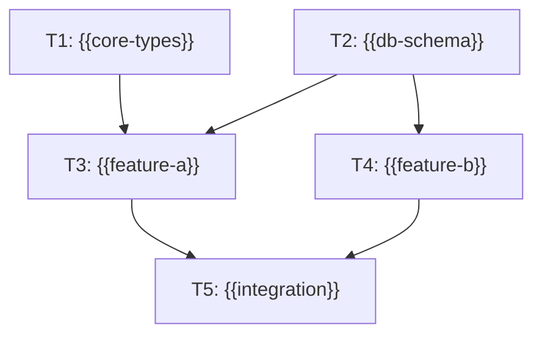

# Task Manifest: {{plan-name}}

> **Generated:** {{timestamp}} | **Plan:** `.plan/{{DD-MM-YYYY}}/{{name}}/`
> **Execution model:** DAG | **Total tasks:** {{N}} | **Levels:** {{L}}
> **Execution:** Tasks at the same level dispatch in parallel; levels run
> sequentially in topological order. Level N worktrees receive Level 1..N-1
> output via the integration branch before their subagents start.

---

## Execution Model: DAG

_Tasks are nodes; a directed edge `A → B` means "B depends on A". The graph
is acyclic. Same-level tasks run in parallel; levels execute sequentially.
A zero-edge DAG (all tasks at Level 1) is fully parallel._

| Level | Tasks | Notes |
|-------|-------|-------|
| 1 | T1, T2 | Foundation — no dependencies |
| 2 | T3, T4 | Consume Level 1 output |
| 3 | T5 | Consumes Level 2 output |
| {{...}} | ... | ... |

---

## Task Inventory

| Task ID | Level | Slug | Owns Tests | Depends On | Task File | Worktree | Branch | Verification |
|---------|-------|------|------------|------------|-----------|----------|--------|-------------|
| T1 | 1 | {{core-types}} | ✅ | — | `.plan/.../tasks/task-t1-{{core-types}}.md` | `.worktrees/t1-{{core-types}}/` | `agent/t1-{{core-types}}` | `pytest tests/core -v` |
| T2 | 1 | {{db-schema}} | ✅ | — | `.plan/.../tasks/task-t2-{{db-schema}}.md` | `.worktrees/t2-{{db-schema}}/` | `agent/t2-{{db-schema}}` | `pytest tests/db -v` |
| T3 | 2 | {{feature-a}} | ✅ | T1, T2 | `.plan/.../tasks/task-t3-{{feature-a}}.md` | `.worktrees/t3-{{feature-a}}/` | `agent/t3-{{feature-a}}` | `pytest tests/features/test_a.py -v` |
| T4 | 2 | {{feature-b}} | ✅ | T2 | `.plan/.../tasks/task-t4-{{feature-b}}.md` | `.worktrees/t4-{{feature-b}}/` | `agent/t4-{{feature-b}}` | `pytest tests/features/test_b.py -v` |
| T5 | 3 | {{integration}} | ✅ | T3, T4 | `.plan/.../tasks/task-t5-{{integration}}.md` | `.worktrees/t5-{{integration}}/` | `agent/t5-{{integration}}` | `pytest tests/integration -v` |
| {{...}} | ... | ... | ... | ... | ... | ... | ... | ... |

---

## Task DAG

_Every subagent relationship expressed in DAG form: mermaid diagram, ASCII
diagram, and edge list. `execute` schedules dispatch from this section._

### Mermaid



### ASCII

```
Level 1            Level 2            Level 3
  T1 ──┐
       ├──► T3 ──┐
  T2 ──┘         ├──► T5
       └──► T4 ──┘
```

### Edge List

| Task | Depends On | Why |
|------|------------|-----|
| T3 | T1, T2 | imports core types + db schema |
| T4 | T2 | queries the db schema |
| T5 | T3, T4 | integration test over both features |
| {{...}} | ... | ... |

**Acyclicity:** no edge path returns to its start → ✅ valid DAG
**Topological order:** Level 1 (T1, T2) → Level 2 (T3, T4) → Level 3 (T5)
**Consistency:** every edge points from a lower level to a higher level ✅

---

## File Ownership Map

_Every file belongs to exactly one task per level. Every test file is owned
by the same task as its implementation. Zero overlap within each level;
cross-level overlaps are documented below._

| File | Owner | Level | Action |
|------|-------|-------|--------|
| `src/core/types.py` | T1 | 1 | CREATE |
| `src/db/schema.py` | T2 | 1 | CREATE |
| `src/features/a.py` | T3 | 2 | CREATE |
| `src/features/b.py` | T4 | 2 | CREATE |
| `src/features/__init__.py` | T3 | 2 | EDIT |
| `tests/core/test_types.py` | T1 | 1 | CREATE |
| `tests/features/test_a.py` | T3 | 2 | CREATE |
| `tests/features/test_b.py` | T4 | 2 | CREATE |
| {{...}} | ... | ... | ... |

**Validation:** {{N}} files, unique write owner per level → ✅ zero write
conflicts within each level.
**Test bundling:** {{K}} test files, all owned by same task as their
implementation → ✅ tests never split.

### Cross-Level File Overlaps

_Later levels intentionally edit files created by earlier levels. These
overlaps are safe because levels execute sequentially._

| File | Earlier-Level Owner | Later-Level Owner | Notes |
|------|--------------------|--------------------|-------|
| `src/core/types.py` | T1 (Level 1 — CREATE) | T3 (Level 2 — EDIT, extend types) | T3 extends the types T1 created |
| {{...}} | ... | ... | ... |

---

## Execution Status

_Updated by the `execute` skill during execution._

| Task ID | Level | Status | Started | Completed | Result |
|---------|-------|--------|---------|-----------|--------|
| T1 | 1 | ⬜ pending | — | — | — |
| T2 | 1 | ⬜ pending | — | — | — |
| T3 | 2 | ⬜ pending | — | — | — |
| T4 | 2 | ⬜ pending | — | — | — |
| T5 | 3 | ⬜ pending | — | — | — |
| {{...}} | ... | ... | ... | ... | ... |

Statuses: ⬜ pending | 🟡 running | 🟢 passed | 🔴 failed
